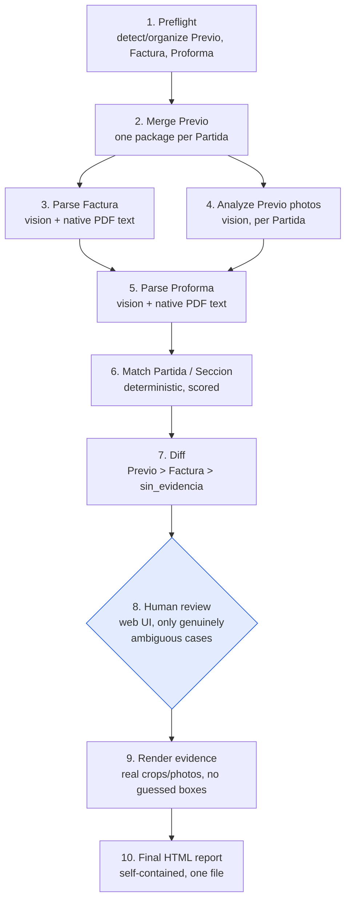

# pedimento-matcher

A Claude Code [Agent Skill](https://agentskills.io) that cross-checks the
three sources used to validate a Mexican customs import operation:

- **Previo** — photos of the physical goods, organized by Partida.
- **Factura** — the commercial invoice (rows = Partidas).
- **Proforma / Pedimento** — the draft customs declaration (rows = Secciones).

Sección order in the Proforma doesn't always match Partida order in the
Factura, and Secciones sometimes carry wrong data (marca, lote, país de
origen, modelo/código de producto...) that today gets caught only by manual
review. This skill automates that cross-check end to end: it parses all
three sources (vision + native PDF text, no external extraction API), runs a
deterministic matching + diff pass, routes the genuinely ambiguous cases to
a human through a local web UI, and produces a self-contained HTML report
with real photo/PDF evidence for every discrepancy.

Ground rule throughout the pipeline: a value is only ever `"sin_evidencia"`
(no evidence) or a value actually read from a source — never invented or
silently inferred.

## Install

```bash
gh skill install AngelMaldonado/pedimento-matcher pedimento-matcher --agent claude-code
```

or with the generic [skills CLI](https://skills.sh):

```bash
npx skills add AngelMaldonado/pedimento-matcher --skill pedimento-matcher
```

## Requirements

- Python 3 (standard library only — no `pip install` needed, including for
  the Paso 8 web UI server).
- `poppler` (`pdftoppm`, `pdftotext`) on `PATH`.
- A working directory containing `previo/`, a Factura PDF, and a
  Proforma/Pedimento PDF, laid out as described in the skill's Paso 1
  (Preflight).

Install `poppler`:

```bash
# macOS (Homebrew)
brew install poppler

# Debian/Ubuntu
sudo apt-get update && sudo apt-get install -y poppler-utils

# Fedora/RHEL
sudo dnf install -y poppler-utils

# Arch
sudo pacman -S poppler

# Windows (Chocolatey)
choco install poppler

# Windows (Scoop)
scoop install poppler
```

Verify it's on `PATH`:

```bash
pdftoppm -v && pdftotext -v
```

## Usage

Invoke the skill from a Claude Code session with the working directory as
argument (or no argument to use the current directory):

```
/pedimento-matcher path/to/operation
```

## Pipeline

10 steps: raw parsing first, deterministic matching/diff second, a human
only for the cases that are genuinely ambiguous, evidence-backed report
last.



See `pedimento-matcher/SKILL.md` for the full step-by-step contract, design
rationale, and a real pilot run's results.

## License

MIT — see [LICENSE](LICENSE).
